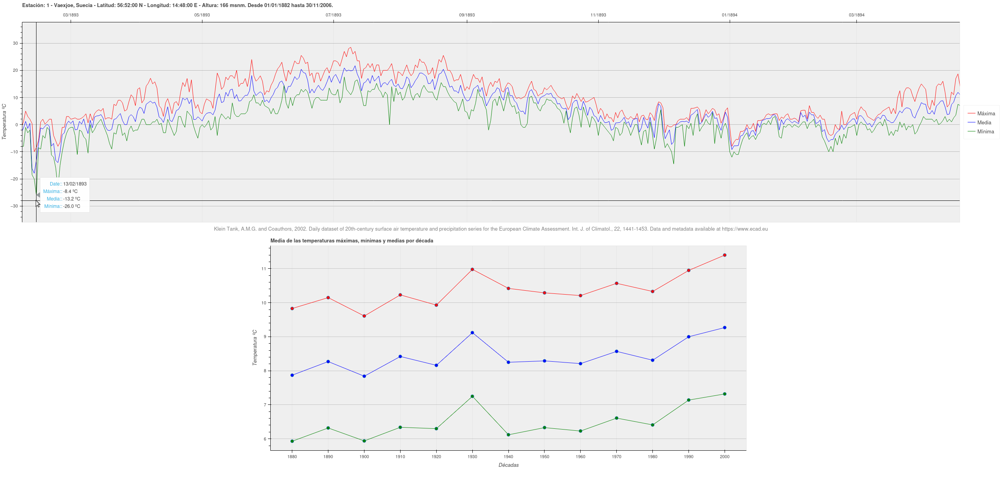

# This WebApp shows a global map with meteorological stations.

Once stations data has been processed it allows to select an station to show its maximum, minimum and mean temperatures in a graph, to see its evolution over time per decade.
Work in progress.

## Database Initialization

To initialize the database use the following commands:

```
export PYTHONPATH=/path/to/flaskr/directory
flask --app flaskr/app init-db to initialize database.
```
It will delete all existent data and tables.
This does not create the database and user, and does not grant privileges.

## Example of the temperatures graphs

